# System Design

## Design principles

1. Policy questions first; data engineering serves analysis rather than raw collection.
2. Separate public schedule metadata from restricted/licensed source content.
3. Every imported row must carry provenance, version and parser metadata.
4. Crosswalks are hypotheses with confidence, not facts.
5. Published prices and effective payer costs are distinct variables.
6. The repository should be agent-readable through Conductor context files.

## High-level architecture

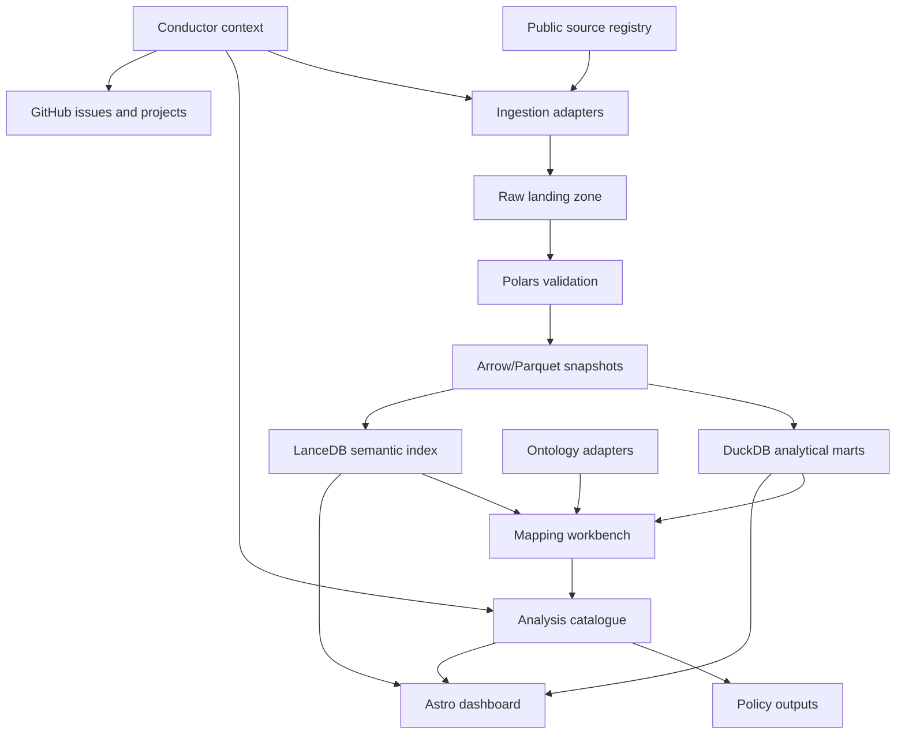

## Live-source validation gate

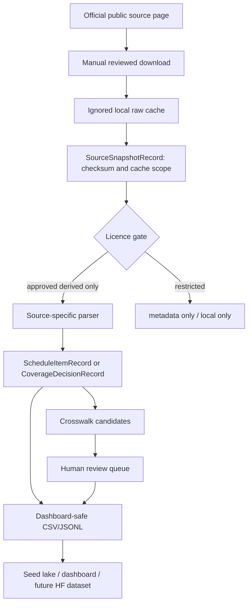

## Repository and context architecture

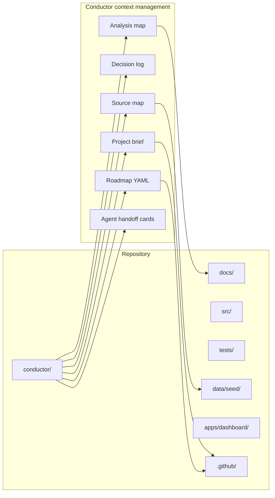

## Data model

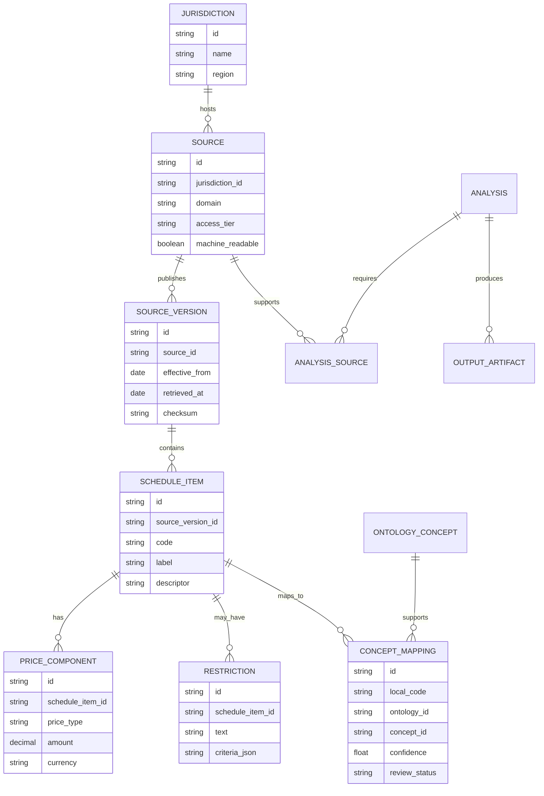

## Mapping workflow

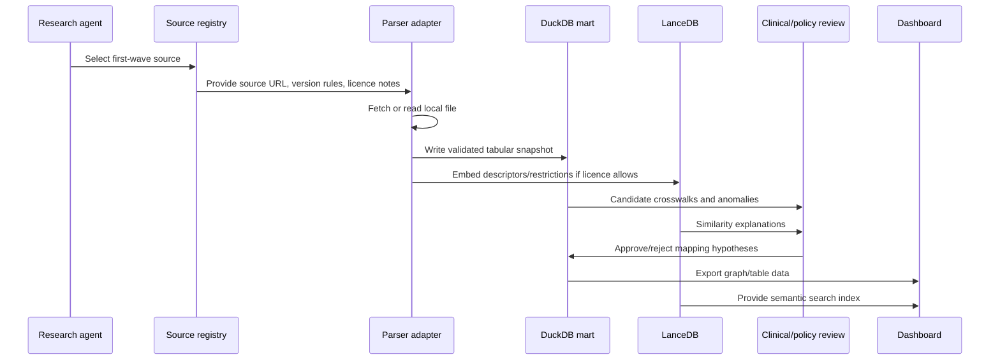

## Analysis pipeline

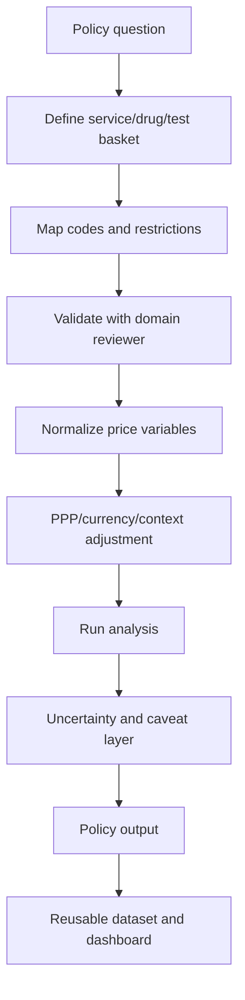

## Dashboard design

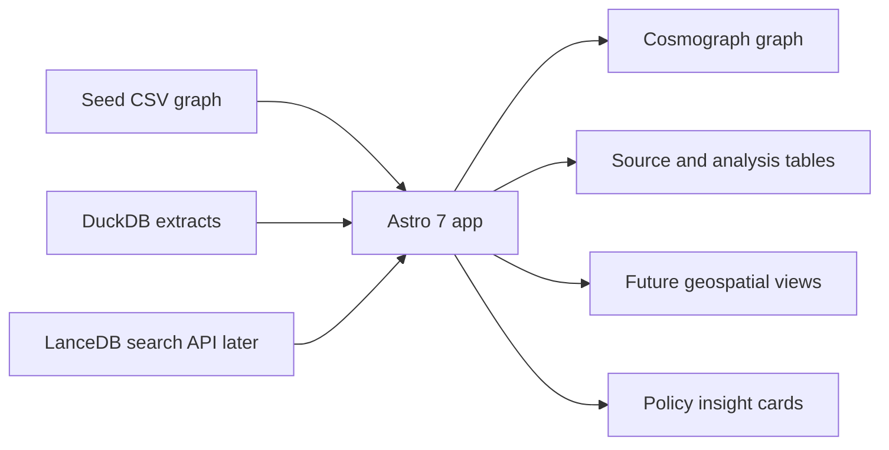

## Storage design

| Layer | Default | Purpose |
|---|---|---|
| Raw landing | local ignored `data/raw/` and `data/raw_live/` | User-supplied and live-downloaded source files. |
| Seed | tracked `data/seed/` | Permissive registry and graph design data. |
| Processed | local ignored `data/processed/` | Arrow/Parquet snapshots from parsers. |
| Analytical | DuckDB | Joins, marts, reproducible analyses. |
| Semantic | LanceDB | Embeddings of descriptors, restrictions and coverage text when allowed. |
| Public dataset | Hugging Face datasets | Only permissive derived/metadata data. |
| Dashboard | Hugging Face Spaces | Public seed and analysis outputs. |

## First-wave implementation slices

1. Validate seed registries and JSON schemas.
2. Build source-quality scoring.
3. Implement MBS XML parser.
4. Implement CMS PFS and CLFS parsers.
5. Implement PBS CSV/API parser.
6. Implement NHS genomic directory parser.
7. Build mapping model and human-review tables.
8. Add local-source snapshot and parse CLI commands.
9. Render seed graph, source-status table and review queue in dashboard.
10. Add LanceDB semantic search over permitted descriptors.
11. Convert Conductor roadmap into GitHub issues.

## Key design risks

| Risk | Mitigation |
|---|---|
| False comparability | Bundle taxonomy, vignettes, confidence scores and explicit caveats. |
| Licence breach | Licence gate, local-only restricted cache, no proprietary descriptor mirroring. |
| Over-engineering | Thin vertical slices and ADRs for every major stack addition. |
| Ontology complexity | Start with metadata-only ontology registry and one high-value pathway: genomics/pathology. |
| Effective price opacity | Model transparency and published-price variables separately. |
| Agent drift | Conductor context files are mandatory reading before implementation. |

## v5 reviewed-source bundle and publication flow

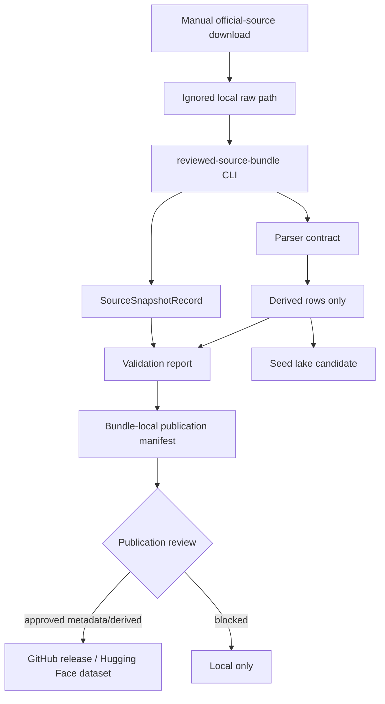

## Analysis recipe graph

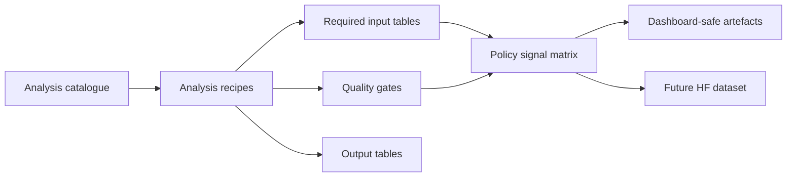

## v8 exact source-file layer

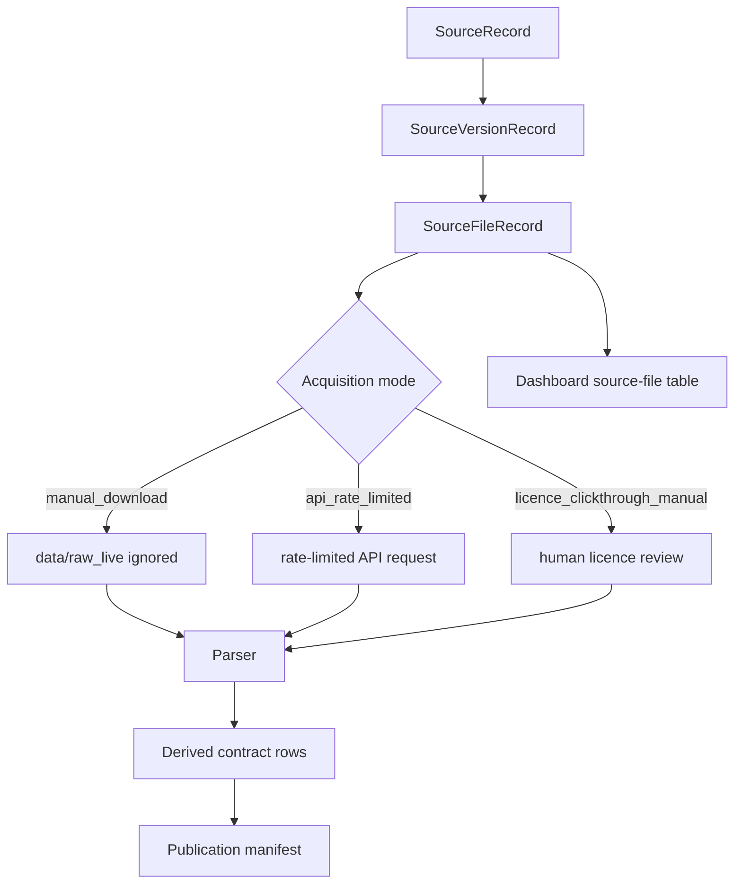

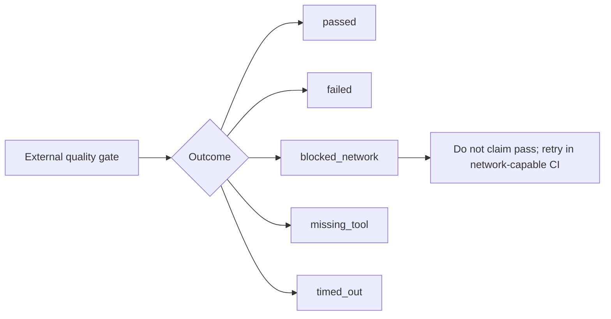
