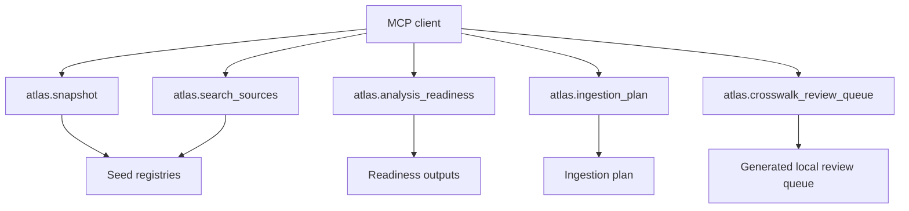

# CLI, API and MCP interface plan

The atlas should expose the same read-only core through three interfaces: CLI first, then local API, then MCP.

## CLI

Current CLI commands:

| Command | Purpose |
|---|---|
| `validate` | Validate seed registries and source references. |
| `sources` | Show registered sources, optionally filtered by domain. |
| `analyses` | Show planned policy analyses. |
| `score-sources` | Print source readiness scores. |
| `readiness` | Write source and analysis readiness CSV/JSONL. |
| `ingestion-plan` | Write parser/source-version task plans. |
| `acquisition-plan` | Write licence-gated acquisition and blocker tables. |
| `seed-lake` | Materialise seed registries into local JSONL/CSV lake layout. |
| `source-snapshots` | Write checksum/provenance records for committed synthetic fixtures. |
| `vertical-slice` | Parse local fixtures and write derived records. |
| `export-graph` | Generate graph nodes/edges for dashboard. |
| `snapshot` | Emit a concise Conductor handoff snapshot. |
| `export-schema` | Export Pydantic JSON schemas. |

The read-only registry commands `runtime-targets`, `roadmap`, `sources`,
`source-status`, `source-files`, `analyses`, `score-sources`, and
`license-gates` accept `--json`. Their default Rich tables remain intended for
interactive use; JSON mode emits stable arrays, except `roadmap`, which emits
an object containing `tracks` and the total `function_count`. These outputs
contain registry or derived metadata only and never bypass source licence
gates. For example:

```bash
reimbursement-atlas sources --domain australian --json
reimbursement-atlas roadmap --json
```

## API

`src/reimburse_atlas/api.py` contains an optional read-only FastAPI factory. It is deliberately lightweight and imports FastAPI lazily.

Planned endpoints:

| Endpoint | Output |
|---|---|
| `/health` | Status check. |
| `/sources` | Source registry records. |
| `/analyses` | Analysis catalogue records. |
| `/readiness/sources` | Source readiness rows. |
| `/readiness/analyses` | Analysis readiness rows. |
| `/ingestion/first-wave` | First-wave ingestion tasks. |

Run locally after installing the API extra or Pixi API environment:

```bash
pixi run -e api api-dev
```

## MCP

The MCP surface remains read-only. The initial tool manifest is in `mcp/tools.seed.json`, and `src/reimburse_atlas/mcp_server.py` provides a lazy optional MCP Python SDK 2 server factory for the same read-only concepts. The adapter uses the supported, typed `mcp.server.MCPServer` API and intentionally has no MCP 1 compatibility shim.

Planned MCP tools:


```mermaid
flowchart TD
    A[MCP client] --> B[atlas.snapshot]
    A --> C[atlas.search_sources]
    A --> D[atlas.analysis_readiness]
    A --> E[atlas.ingestion_plan]
    A --> F[atlas.crosswalk_review_queue]
    B --> G[Seed registries]
    C --> G
    D --> H[Readiness outputs]
    E --> I[Ingestion plan]
    F --> J[Generated local review queue]
```

Run locally after installing the MCP extra or Pixi MCP environment:

```bash
pixi run -e mcp mcp-dev
```

No MCP tool should fetch live schedules, access restricted ontologies, or publish raw files until those operations are behind explicit user-supplied credentials and licence gates.

The supported SDK range is `mcp>=2.1.1,<3`. Any future major upgrade must preserve zero-error BasedPyright validation and the MCP integration tests; removed APIs must not be restored through permanent compatibility shims.
