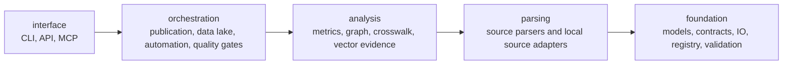

# Architecture boundaries

The repository now treats architecture as a generated quality gate rather than an informal diagram.

`reimburse_atlas.architecture` scans Python source files with `ast`, extracts internal `reimburse_atlas` import edges, maps each module to a layer, and emits dashboard-safe artefacts under `data/derived/architecture/`.

## Layer model



The rule is simple: a higher layer may depend on a lower layer, but a lower layer may not depend on a higher layer. Internal import cycles are also reported.

## Generated artefacts

```bash
PYTHONPATH=src reimbursement-atlas architecture-report
```

Outputs:

- `data/derived/architecture/import_edges.{jsonl,csv}`
- `data/derived/architecture/layer_policy.{jsonl,csv}`
- `data/derived/architecture/import_cycles.{jsonl,csv}`
- `data/derived/architecture/summary.json`

A non-ready architecture report should block release hardening until the violation is resolved or the layer map is deliberately updated in code and ADRs.
