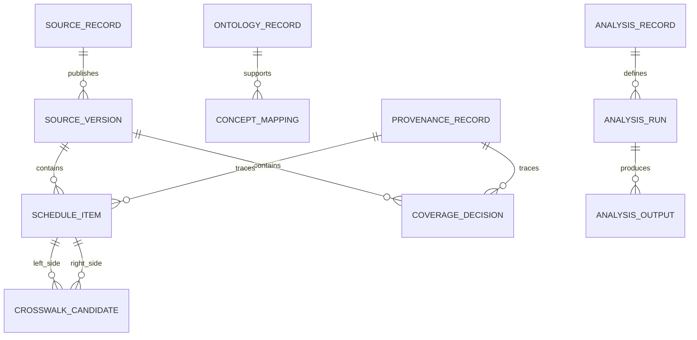

# Data model

The atlas separates source metadata, raw acquisitions, derived contracts, mappings and analysis outputs.

## Core contracts

The current executable contracts live in `src/reimburse_atlas/contracts.py`:

- `ProvenanceRecord`
- `ScheduleItemRecord`
- `CoverageDecisionRecord`
- `CrosswalkCandidate`

JSON schemas are exported to `schema/`.

## Conceptual model

## Schedule item fields

| Field | Purpose |
|---|---|
| `source_id` | Link back to the registry source. |
| `jurisdiction` | Human-readable jurisdiction. |
| `domain` | Medical service, laboratory, medicine, hospital, device, etc. |
| `code_system` | Native coding system, such as MBS, HCPCS, CLFS, ATC, DRG. |
| `item_code` | Native item/code identifier. |
| `item_label` | Short non-proprietary label where redistributable. |
| `payment_amount` | Public payment/list/tariff amount where comparable. |
| `currency` | Currency code, if monetary. |
| `payment_unit` | Item, point, episode, day, package, script, vial, etc. |
| `restriction_text` | Reusable restriction summary, not restricted proprietary descriptors. |
| `professional_component` | Whether professional component is included. |
| `facility_component` | Whether facility component is included. |
| `provenance` | Retrieval, licence and transformation metadata. |

## Mapping confidence model

Crosswalks should be stored as candidates, never treated as truth by default.

| Status | Meaning |
|---|---|
| `unreviewed` | Machine-generated or seed hypothesis. |
| `machine_reviewed` | Passed automated consistency checks. |
| `clinician_reviewed` | Reviewed by a domain expert. |
| `rejected` | Known bad mapping retained for auditability. |

Confidence is numeric, but policy outputs should bin confidence into auditable categories and show uncertainty.
