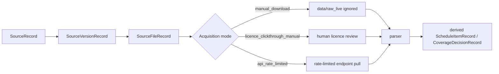

# Exact source files and acquisition gates

Date: 2026-07-04

The atlas now separates a source family from an exact file, landing page or endpoint needed for first-wave validation.

## Why this exists

A schedule such as `au_mbs` or `us_cms_clfs` is too broad for reproducible ingestion. A parser needs an exact file or endpoint, a source-version id, a licence gate, and an acquisition mode. The `SourceFileRecord` layer captures those details without committing raw source files.



## Current exact first-wave records

`data/seed/source_files.*` currently tracks:

| id | purpose |
|---|---|
| `au_mbs_20260701_imap_txt` | Current MBS item-map TXT file. |
| `au_mbs_20260701_desc_txt` | Current MBS descriptor TXT file. |
| `au_mbs_2010_2019_downloads_page` | MBS archive index for historical releases from 2011 to 2019. |
| `us_cms_clfs_26clabq3_page` | CMS metadata page for the 2026 Q3 CLFS release. |
| `us_cms_clfs_26clabq3_ama_zip` | AMA-gated CLFS ZIP download path. |
| `au_pbs_api_v3_documentation` | PBS API/CSV distribution documentation and endpoint family. |
| `us_cms_asp_july_2026_payment_limit_page` | CMS ASP July 2026 payment-limit page. |
| `us_cms_pfs_rvu26c_page` | CMS PFS RVU26C relative value file page. |

## Command surface

```bash
PYTHONPATH=src reimbursement-atlas source-files
PYTHONPATH=src reimbursement-atlas validate
PYTHONPATH=src reimbursement-atlas export-graph data/seed
```

## Publishing posture

The source-file records are metadata and can be published. The raw source files should still stay in ignored local paths unless a human reviewer approves redistribution.

For CMS CLFS, the exact file record deliberately points to the licence-gated CMS path rather than automating download. The parser can process a reviewed local extract, but the repo must not automate AMA click-through acceptance or redistribute CPT descriptors.
