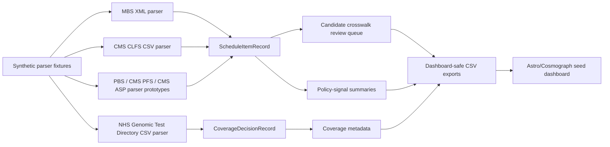

# First executable slice

Date: 2026-07-03

This repository now contains a no-network vertical slice that exercises the core design without mirroring live public schedules or redistributing restricted terminology/descriptor text.

## What the slice does



## Generated artefacts

| Path | Purpose |
|---|---|
| `data/seed/source_readiness.*` | Source access, reproducibility and transparency scoring. |
| `data/seed/analysis_readiness.*` | Analysis readiness using weakest-source bottleneck logic. |
| `data/seed/first_wave_ingestion_plan.*` | Parser/source-version task plan. |
| `data/seed/source_acquisition_plan.*` | Licence-gated acquisition plan separated from parser tasking. |
| `data/seed/ingestion_readiness.*` | Blocker summary for promoting fixtures to live-source prototypes. |
| `data/derived/vertical_slice/schedule_items.*` | Normalised schedule-item records parsed from synthetic fixtures. |
| `data/derived/vertical_slice/coverage_decisions.*` | Normalised coverage-decision records parsed from synthetic fixtures. |
| `data/derived/vertical_slice/crosswalk_candidates.*` | Machine-generated review queue, not final mappings. |
| `data/seed/source_snapshots.*` | Checksums, byte sizes and cache-scope gates for parser fixtures. |
| `data/seed/source_status.*` | Current source observations and recommended acquisition actions. |
| `data/derived/vertical_slice/crosswalk_review_queue.*` | Human-review priority queue for machine mappings. |
| `data/derived/seed_lake/*` | Local JSONL/CSV seed-lake materialisation and manifest. |
| `apps/dashboard/public/data/*` | Dashboard-safe generated CSVs copied from seed/derived artefacts. |

## Local commands

```bash
PYTHONPATH=src python scripts/make_graph_seed.py
PYTHONPATH=src python scripts/make_readiness_tables.py
PYTHONPATH=src python scripts/make_ingestion_plan.py
PYTHONPATH=src python -m reimburse_atlas.cli acquisition-plan data/seed
PYTHONPATH=src python scripts/make_vertical_slice.py
PYTHONPATH=src python scripts/make_source_snapshots.py
PYTHONPATH=src python scripts/check_public_data_policy.py
PYTHONPATH=src python -m reimburse_atlas.cli seed-lake data/derived/seed_lake
PYTHONPATH=src python scripts/sync_dashboard_seed.py
PYTHONPATH=src pytest -q
```

With Pixi:

```bash
pixi run graph-seed
pixi run readiness
pixi run ingestion-plan
pixi run acquisition-plan
pixi run vertical-slice
pixi run source-snapshots
pixi run seed-lake
pixi run dashboard-seed
pixi run test
```

## Current limits

The fixtures are intentionally synthetic. They validate contracts and pipeline shape, but they do not claim to be real fee schedules, real NHS test-directory rows, or real CPT/MBS/PBS descriptors.

The next live-source step should be narrow: manually download current MBS descriptor/item-map files and one CMS CLFS file, record licence/provenance metadata, parse into local ignored cache, and publish only permitted derived fields. PBS API/CSV, CMS PFS RVU and CMS ASP files now have fixture-backed parser contracts ready for the same flow.
