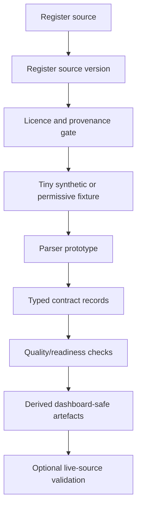

# Implementation blueprint

## Core principle

Build thin, reviewable vertical slices. Every new source should pass through the same gates:

## Package layers

| Layer | Package/module | Responsibility |
|---|---|---|
| Registry | `models.py`, `registry.py` | Source, source-version, analysis and ontology metadata. |
| Contracts | `contracts.py` | Normalised schedule, coverage, provenance and crosswalk records. |
| Parsers | `parsers/` and `adapters/` | Fixture-backed parser prototypes and adapter classes. |
| Ingestion planning | `ingest/`, `ingestion.py` | No-fetch acquisition plans, network policy and licence gates. |
| Analysis | `analysis/`, `policy_metrics.py`, `crosswalk.py` | Readiness, policy-signal summaries and crosswalk review queues. |
| Storage | `datalake.py`, `warehouse.py` | Seed-lake and optional DuckDB/Polars materialisation. |
| Interfaces | `cli.py`, `api.py`, `mcp/` | CLI, optional read-only API, planned read-only MCP. |
| Dashboard | `apps/dashboard/` | Astro/Cosmograph dashboard over generated CSVs. |

## Near-term development order

1. Consolidate parser fixtures under `tests/fixtures/parsers/` and retire duplicate shape fixtures once the flexible parsers are validated.
2. Add local-source cache rules in `.gitignore` for live downloaded files.
3. Add explicit `SourceSnapshotRecord` with checksum, content type, retrieved timestamp and licence decision.
4. Promote MBS and CMS CLFS parser prototypes from synthetic fixtures to manually downloaded local files.
5. Add Polars transformations from parsed JSONL to Arrow/Parquet and DuckDB views.
6. Add dashboard tables for source readiness, analysis readiness and crosswalk review queue.
7. Add optional LanceDB embeddings only after baseline token matching has review labels.

## Definition of done for a source parser

- Source registry record exists.
- Source version record exists.
- Licence gate is documented.
- Minimal permissive fixture exists.
- Parser emits typed records.
- Parser has unit tests and one e2e/generated artefact path.
- Generated records include provenance.
- Restricted descriptors are not committed unless licence review permits.
- Dashboard-safe derived output is generated.
