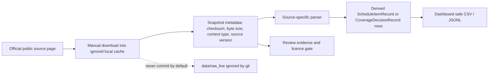

# Live-source validation playbook

Date: 2026-07-03

This playbook defines the narrow path from synthetic parser fixtures to reviewed public-source files. The repo should still avoid automatic broad web fetching until provenance, licence and descriptor-governance rules are mature.

## Principle



Raw files from live sources belong in ignored local paths such as `data/raw_live/<source_id>/`. Public artefacts should be derived, minimal, attributable and licence-reviewed.

## Current first-wave source observations

These observations are encoded in `data/seed/source_status.*` so they can be surfaced in the CLI and dashboard.

| Source | Current observation | Next action |
|---|---|---|
| MBS | 20260701 item-map and descriptor TXT files visible on the MBS downloads page. | Download locally and run the redacted `reviewed-mbs-txt-pair-bundle` workflow before any publication decision. |
| PBS | PBS API is the current distribution mechanism; JSON and CSV downloads are supported, the public API is updated monthly, and access is shared-rate-limited. The current API route requires a subscription key even though the data API documentation is publicly readable. | Resolve the current public Swagger request URL, supply the key only through an environment secret, fetch `schedules` before selecting a monthly `schedule_code`, then retain only a reviewed JSON/CSV extract and redacted provenance. |
| CMS CLFS | CY 2026 Q3 `26CLABQ3` file visible. | Download locally, snapshot, and parse payment fields while avoiding restricted CPT descriptor redistribution. |
| CMS PFS | 2026 RVU files visible, including RVU26A/RVU26B/RVU26C. | Download locally, derive facility/non-facility payment fields, and keep CPT governance separate. |
| CMS ASP | July 2026 Medicare Part B payment-limit and NDC-HCPCS crosswalk files visible. | Snapshot payment-limit and crosswalk files, then parse payment-limit fields as price-but-not-coverage evidence. |

## Commands

Create a source observation/status table:

```bash
PYTHONPATH=src reimbursement-atlas source-status
```

Snapshot a manually downloaded file without committing the raw data:

```bash
PYTHONPATH=src reimbursement-atlas snapshot-local-file \
  --source-version-id au_pbs_seed_fixture \
  --content-type text/csv \
  data/raw_live/au_pbs/items-overview.csv
```

Parse a reviewed local file into derived rows:

```bash
PYTHONPATH=src reimbursement-atlas parse-local-source \
  --source-version-id au_pbs_seed_fixture \
  data/raw_live/au_pbs/items-overview.csv \
  --output-dir data/derived/reviewed_sources
```

Run the publication hygiene check:

```bash
PYTHONPATH=src python scripts/check_public_data_policy.py
```

## Promotion gates

A parser can be promoted from `prototype` to `validated` only when:

1. the source page and exact file version are recorded;
2. a SHA-256 checksum is recorded;
3. cache scope is explicit: `local_raw_only`, `public_derived_only`, `metadata_only` or `public_raw_cache`;
4. restricted descriptors, CPT text, UMLS content and confidential prices are excluded from public outputs;
5. at least one unit test and one parse-local-source smoke test pass;
6. generated schema and dashboard-safe CSV outputs are refreshed.

## What remains out of scope

The repo should not yet perform broad scheduled fetches, scrape PDFs at scale, publish raw restricted terminology packages, or infer net drug prices from published list/payment-limit fields. Live ingestion should remain manually reviewed until at least the first MBS, PBS, CLFS, PFS and ASP validations are complete. The PBS documentation page is not itself a monthly extract: the current API route returned HTTP 401 without a subscription key during the 2026-07-16 probe, so the key and exact Swagger request URL remain acquisition prerequisites.

## v5 reviewed-source bundle workflow

Use `reviewed-source-bundle` when a manually downloaded public file is ready for local validation.

```bash
PYTHONPATH=src reimbursement-atlas reviewed-source-bundle \
  --source-version-id au_pbs_seed_fixture \
  --content-type text/csv \
  data/raw_live/au_pbs/items-overview.csv
```

The command creates a derived-only bundle under `data/derived/reviewed_source_bundles/`. The raw file remains in the ignored local raw cache.

Review before publication:

1. `validation_report.json` confirms parse success and record count.
2. `source_snapshots.jsonl` records checksum and byte size.
3. `publication_manifest.json` warns whether human licence review is still required.
4. Parsed rows should be inspected for restricted descriptors, and bundle snapshots should keep `local_path` redacted.

Do not use a successful bundle as evidence that the source can be redistributed. It only proves that the local file was checksummed and parsed into the project contracts.
## v10 MBS TXT-pair bundle workflow

Use `reviewed-mbs-txt-pair-bundle` for the July 2026 MBS TXT pair rather than the generic one-file bundle command:

```bash
PYTHONPATH=src reimbursement-atlas reviewed-mbs-txt-pair-bundle \
  data/raw_live/au_mbs/20260701_MBSONLINE_IMAP.TXT \
  data/raw_live/au_mbs/20260701_MBSONLINE_DESC.TXT \
  --output-dir data/derived/reviewed_source_bundles
```

The bundle snapshots both files, redacts local raw paths in `source_snapshots.*`, joins descriptors to item-map rows by item code, and writes pair-specific validation statistics. See `docs/MBS_REVIEWED_PAIR_BUNDLE.md`.
