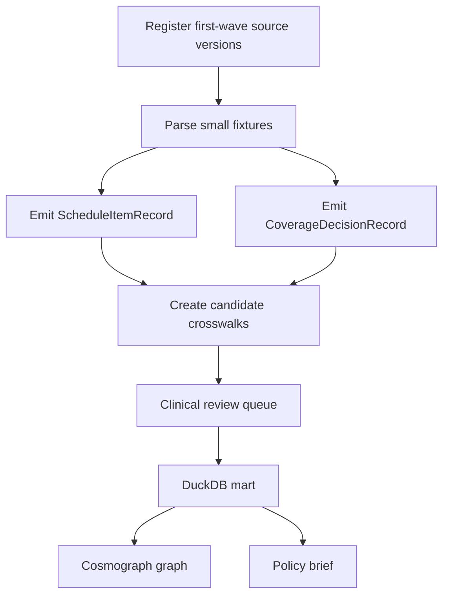

# Pilot vertical slice: genomics and pathology

## Why this slice

Genomics/pathology is the best first demonstrator because it combines:

- accessible public schedules;
- clinically meaningful crosswalk complexity;
- policy interest in access, diffusion and restrictions;
- strong ontology dependencies, especially LOINC, HPO, HGNC and condition coding;
- clear contrast between Australian national listing and US CMS/MAC coverage architecture.

## Scope

First source set:

1. `au_mbs`
2. `au_msac`
3. `us_cms_clfs`
4. `us_cms_mcd`
5. `uk_genomic_test_directory`
6. `au_aihw_mbs_pbs_stats`

## Initial research questions

1. Which genomic/pathology services are publicly listed?
2. Which have explicit eligibility restrictions?
3. Which coverage decisions include analytical validity, clinical validity or clinical utility reasoning?
4. How quickly does utilisation change after listing?
5. Which mappings require LOINC/HPO/HGNC versus manual clinical review?

## Minimal technical tasks

## Non-goals

- Do not redistribute CPT descriptors.
- Do not claim one-to-one equivalence between MBS items and CPT/HCPCS codes without review.
- Do not use confidential effective prices.
- Do not bundle restricted ontology files into the public repo or Hugging Face dataset.
